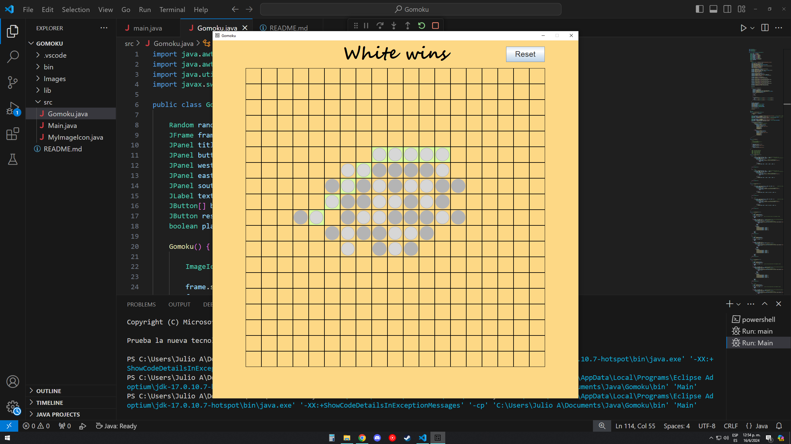

# Gomoku
Gomoku game with 19x19 board, connect 5 of your pieces in a line to win, it can be horizontal, vertical or diagonal

## Built with:
Java

## Features:
- Play with turns
- Can win with multiple combinations
- Can win with 5 or more pieces in a line
- Reset the game at anytime

## How to use:
1. Install java
2. Run the program

## Credits:
Julio Salazar

