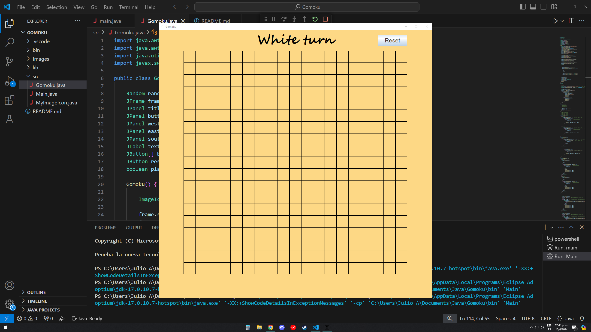
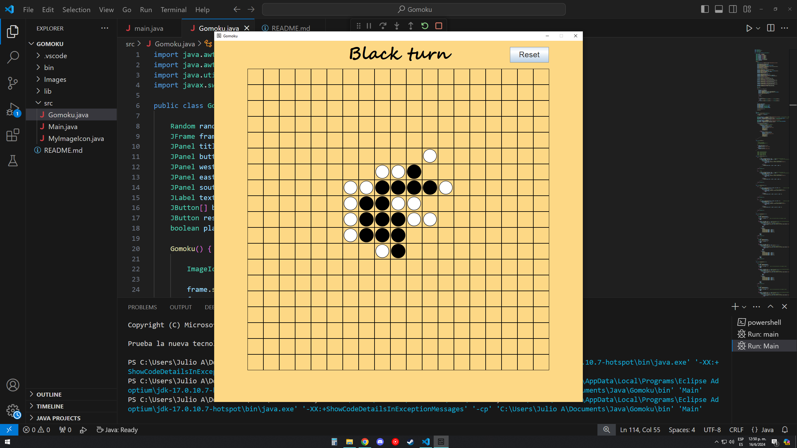

# Clicks Per Second
CPS app using Java Swing, it counts how many clicks you can do in 5 seconds, comes with a funny emoji reaction.

## Built with:
Java

## Features:
- Start, stop and reset button
- 5 seconds until result

## How to use:
1. Install java
2. Run the program

## Credits:
Julio Salazar
